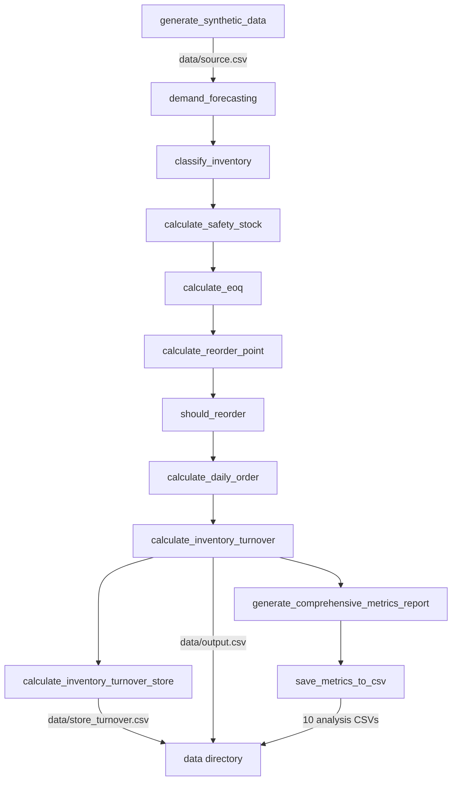

# Project Analysis (detailed)

Based on `main` at `98e48fb` (2026-09-29). Short version: [PROJECT_ANALYSIS.md](PROJECT_ANALYSIS.md).

## Purpose and current status

Inventory Optimizer generates synthetic retail sales and stock data and runs it through a set of classic inventory
planning formulas, producing CSV files for each metric. It is a self-contained reference implementation: there is no
API, no scheduler and no ingestion path for real data, and `main()` always calls `generate_synthetic_data()`
(`inventory_optimization.py:737`).

Activity is low. The repository has two commits: `2801693` (2024-09-28, README) and `98e48fb` (2025-10-13, the
addition of the 10 analytics metrics and the test suite). Licence is MIT (`LICENSE:1`). There are no open issues and
no open pull requests other than this work.

The feature set matches what the README advertises: 6 core metrics and 10 analytics metrics, 13 CSV outputs. A
verified run with the defaults produces all 13 files.

## Tech stack

| Component | In use | Latest on PyPI (2026-09-29) |
|---|---|---|
| pandas | `>=1.5.0` (`requirements.txt:1`) | 3.0.6 |
| numpy | `>=1.21.0` | 2.5.3 |
| holidays | `>=0.14` | 0.105 |
| scikit-learn | `>=1.1.0` | 1.9.1 |
| matplotlib | `>=3.5.0` | 3.11.2 |

No dependency is pinned and there is no lockfile, so the resolved versions depend entirely on the interpreter in use.

At `98e48fb` the Dockerfile used `python:3.8-slim`. Python 3.8 stopped receiving security fixes after its final
release in October 2024, and the current pandas requires Python 3.11 or newer (`requires_python` on PyPI is `>=3.11`).
Building that image resolved pandas 2.0.3, numpy 1.24.4, scikit-learn 1.3.2, matplotlib 3.7.5, holidays 0.58 and
pillow 10.4.0 - all several major versions behind. This branch moves the base image to `python:3.12-slim`, which
resolves pandas 3.0.6, numpy 2.5.3, scikit-learn 1.9.1, matplotlib 3.11.2, holidays 0.105 and pillow 12.3.0.

scikit-learn and matplotlib are only imported by `inventory_optimization_with_graph.py`, not by the pipeline or the
tests.

## Architecture

Single process, single module, file-based input and output.

```
.
├── inventory_optimization.py            # the pipeline: data generation and all 16 metrics
├── test_inventory_optimization.py       # 36 unittest cases
├── inventory_optimization_old.py        # earlier version, not referenced anywhere
├── inventory_optimization_with_graph.py # RandomForest and KMeans experiment, hardcoded /data paths
├── setup_precommit.py                   # installs pre-commit, flake8, isort, black and the hooks
├── Dockerfile                           # image that runs the pipeline
├── run.sh                               # build and run the container with data/ mounted at /data
├── requirements.txt
├── METRICS_DOCUMENTATION.md             # formula reference for the 16 metrics
├── blog.md
└── data/                                # generated CSVs and a plot, committed to the repository
```

Entry points:

- `python inventory_optimization.py` runs `main()` (`inventory_optimization.py:798`).
- `docker run ... inventory_optimizer` runs the same script through the image `CMD` (`Dockerfile:18`).
- `python test_inventory_optimization.py` runs the suite through `run_all_tests()`.

Data flow:



Output location is chosen at runtime: `/data` if that path exists, otherwise `data/` relative to the working
directory (`inventory_optimization.py:762-767` and `:165-172`). That is how the same script serves both the local and
the containerised run.

Data model. `generate_synthetic_data()` builds one row per date, store and SKU with the columns `Date`, `Store`,
`SKU`, `SalesQuantity`, `InventoryLevel`, `UnitCost`, `SellingPrice`, `LeadTime`, `SupplierID`, `Category`,
`OrderedDate`, `OrderedQuantity` and `OrderStatus`. SKU attributes come from a fixed five-category table
(`inventory_optimization.py:76-82`), and demand is a Poisson draw scaled by category multiplier, holidays, weekends
and month (`:109-128`).

There are no external services, no network calls and no authentication anywhere in the codebase.

## Getting started, as verified

Prerequisites: Python 3.11 or newer for a local run, or Docker for the containerised run.

Verified commands, all run from a clean checkout:

```bash
python -m venv .venv && . .venv/bin/activate
pip install -r requirements.txt
python test_inventory_optimization.py     # 36 tests, OK, 0.4s
python inventory_optimization.py          # writes 13 CSVs into data/
```

```bash
docker build -t inventory_optimizer .
docker run -v $(pwd)/data:/data --name inventory_optimizer inventory_optimizer
```

Both were confirmed against `python:3.8-slim` (the base image at `98e48fb`) and `python:3.12-slim` (this branch); the
test suite passes and the pipeline writes 13 CSVs in both.

There is no configuration file and no environment variable is read anywhere in the tree. Behaviour is changed by
passing arguments to `main(country, state, start_date, end_date, num_stores, num_skus, seed)`.

Not verified: `python setup_precommit.py` and `pre-commit run --all-files` were not run, because the `python-linting`
hook fails on the current tree (see Tooling below).

## Code quality

Structure is flat: 25 module-level functions in one 799-line file, each taking and returning a DataFrame. The
pipeline functions mutate and return the same frame, while the 10 analytics functions copy it first, so the two
halves follow different conventions.

Specific findings:

- `import csv` and four of the five `typing` imports were unused (`inventory_optimization.py:3`, `:10`); removed in
  this branch.
- `service_level = 0.95` in `calculate_safety_stock` was assigned and never used (`:203`); removed in this branch.
  The z-score is hardcoded to 1.96 on the next line, so the service level is not actually configurable.
- `calculate_eoq` defines an inner function with the same name as the outer one (`:208-215`), which works but reads
  as a mistake.
- `warnings.filterwarnings('ignore')` runs at import time (`:11`), so any deprecation warning from pandas or numpy is
  invisible, including in the test run.
- `calculate_reorder_point` and `calculate_daily_order` use `df.apply(..., axis=1)` (`:228`, `:253`, `:259`) where
  vectorised expressions would do the same work; this is the main cost as the dataset grows.
- Error handling is limited to `get_holidays`, which swallows every exception and returns an empty set (`:41-43`); a
  wrong state code therefore silently disables holiday effects rather than failing.
- Dead code: `inventory_optimization_old.py` and `inventory_optimization_with_graph.py` are not imported, not tested
  and not referenced by the README. The second one writes to `/data` unconditionally, so it only runs inside the
  container.
- `bandit -r inventory_optimization.py` reports no findings.

## Testing

`test_inventory_optimization.py` contains 36 tests across 7 classes: holidays, data generation, the 6 core metrics,
the 10 analytics metrics, edge cases (empty frame, missing columns, zero sales, negative values, infinities),
report generation and data integrity. All 36 pass in roughly 0.4 seconds.

Measured with `coverage`, the suite covers 71% of `inventory_optimization.py` (294 statements, 85 missed). The gaps
are `main()`, `save_metrics_to_csv()` and `print_metrics_summary()` - that is, the whole output-writing path is
untested, including the `/data` versus `data/` selection.

Assertions are mostly structural (column presence, row counts, types). No test pins a computed value, so a change in
any formula would pass unnoticed.

At `98e48fb` the `__main__` block printed the result but never set an exit code, so `python
test_inventory_optimization.py` returned 0 even when tests failed. That made the `inventory-optimization-tests`
pre-commit hook ineffective. This branch adds `sys.exit(0 if result.wasSuccessful() else 1)`, verified by forcing a
test to fail and confirming exit code 1.

## Security

- Dependency advisories, measured with `pip-audit`: inside the `python:3.8-slim` image, scikit-learn 1.3.2 is
  affected by PYSEC-2024-110 (fixed in 1.5.0) and pillow 10.4.0 (pulled in by matplotlib) by 17 advisories, the
  newest fixed in 12.3.0. Inside `python:3.12-slim`, no project dependency has a known advisory. Moving the base
  image is the fix, and this branch applies it.
- No secrets. There is no `.env`, no credential file, and no match for API key, token, password or AWS key patterns
  anywhere in the tracked tree.
- No input validation is needed: the only input is generated in-process. If custom CSV loading is added, the README's
  suggested `load_custom_data` snippet checks column names but nothing else.
- No authentication, authorisation, CORS, network listener or infrastructure code exists in the repository.
- The container runs as root, the default for `python:*-slim`, and writes to a bind-mounted host directory.

## Performance and scalability

Cost is linear in dates × stores × SKUs. Measured on Python 3.12: the default 3 stores × 3 SKUs × 365 days (3,285
rows) completes in 0.52 seconds; 20 stores × 50 SKUs × 365 days (365,000 rows) takes 18.3 seconds. The whole frame is
held in memory and every metric is recomputed from it, so the ceiling is available RAM. The row-wise `apply` calls
noted above dominate the larger run.

## Tooling and delivery

- `.pre-commit-config.yaml` defines four local hooks: the test suite, flake8, isort and black. The flake8 hook runs
  with no configuration, and flake8 reports 365 findings on `inventory_optimization.py` and
  `test_inventory_optimization.py` (exit code 1), 185 of them `W293` blank line contains whitespace and 107 `E501`
  line too long. The hook therefore cannot pass as things stand. `setup.cfg`, `tox.ini` and `pyproject.toml` are all
  absent, so there is nothing that would relax those defaults, and no black or isort configuration either, which
  means the black and isort hooks would rewrite the files on the first run.
- `setup_precommit.py` installs pre-commit, flake8, isort and black with `pip install` into whatever interpreter is
  active. None of those tools is listed in `requirements.txt`.
- No CI existed at `98e48fb`; this branch adds `.github/workflows/tests.yml`, which runs the suite on `ubuntu-latest`
  with Python 3.12 for pull requests and pushes to `main`.
- `run.sh` removes any existing `inventory_optimizer` container, rebuilds the image and runs it without `--rm`, so a
  stopped container is left behind after each run and removed on the next one.
- Generated output is committed: `data/` holds 14 tracked files (13 CSVs plus `_plot_.png`) totalling 2.3 MB. The
  `.gitignore` entries that would have excluded them are commented out.

## Documentation

`README.md` and `METRICS_DOCUMENTATION.md` are thorough and mostly accurate, but three documented formulas describe
an intent the code does not implement. Each of the three sections in `METRICS_DOCUMENTATION.md` now carries a
"Currently implemented" note recording the gap, and the README metrics table rows 1 and 6 were corrected to describe
the implementation:

1. Safety stock. Both documents give `Z-score × √(Lead Time) × Standard Deviation of Demand`
   (`METRICS_DOCUMENTATION.md:37`, README metrics table row 1). The implementation is `1.96 × std(SalesQuantity)` per
   store and SKU with no lead time term (`inventory_optimization.py:205`).
2. Store turnover. The README metrics table row 6 says `Total Sales / Average Inventory Value`. The implementation
   divides summed sales quantity by mean inventory level, not value (`inventory_optimization.py:279`). Because
   inventory level is a fresh random draw each day, the result is around 244 for `Store001` on a default run, not the
   approximately 2.0 shown in the README's example table.
3. Profitability. The docstring of `calculate_profitable_stagnant_items` and README row 12 describe
   `Profit per Unit × Total Sales Quantity`, but the code multiplies profit per unit by `SalesQuantity` from the last
   row of each store and SKU group (`inventory_optimization.py:479`), which is a single day.

`blog.md` is a copy of the published write-up linked from the README and is not maintained alongside the code.

## Risks and known issues

| Severity | Issue | Evidence |
|---|---|---|
| High | `InventoryLevel` is an independent random draw per row (`inventory_optimization.py:131`) with no link to sales, reorders or deliveries, so every stock-derived metric (turnover, stock-out risk, days to stock-out, excess inventory) describes noise rather than a simulated inventory position | store turnover of 244 on a default run against the README's example of 2.0 |
| High | Vulnerable transitive dependencies in the published image at `98e48fb` | `pip-audit` inside `python:3.8-slim`: scikit-learn PYSEC-2024-110, pillow 17 advisories |
| Medium | The `python-linting` pre-commit hook cannot pass | `flake8` exits 1 with 365 findings |
| Medium | Documented formulas differ from the implementation in three places, now annotated rather than resolved | see Documentation above |
| Medium | Output-writing code is untested, including the `/data` versus `data/` switch | coverage report, 85 missed statements |
| Medium | No dependency pinning or lockfile; the same command produces pandas 2.0.3 or 3.0.6 depending on the interpreter | `requirements.txt`, the two image builds above |
| Low | Generated CSVs are tracked in git and will churn on every run | `git ls-files data` returns 14 files, 2.3 MB |
| Low | Two unreferenced legacy scripts remain at the repository root | `inventory_optimization_old.py`, `inventory_optimization_with_graph.py` |
| Low | `DaysSinceLastOrder` falls back to the sentinel 999 (`inventory_optimization.py:603`) and `EffectiveLeadTime` applies a fixed 10% uplift (`:591`), both undocumented | those lines |

## Strengths

- The pipeline runs end to end with one command and no configuration, on both Python 3.8 and Python 3.12.
- 36 tests cover every metric function including empty, zero and infinite inputs, and they run in under a second.
- `METRICS_DOCUMENTATION.md` explains all 16 metrics with formulas and business rationale, which is unusual for a
  project this size.
- The `/data` versus `data/` switch means the local and containerised runs behave identically without configuration.
- Holiday, weekend and seasonality effects on demand are modelled explicitly and are easy to follow.

Plan derived from this analysis: [IMPROVEMENT_PLAN_DETAILED.md](IMPROVEMENT_PLAN_DETAILED.md).
